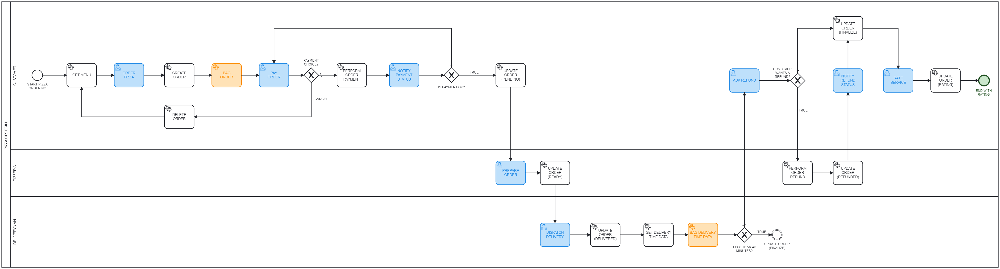

# Online Pizza Ordering

This version of the repository contains the files of the challange about the online pizza ordering process after modifications. It's the second version of the process. Later, another versions of this process will be avaliable. 

# Ins and Outs of nodes in the process (first version)

On this page, the inputs and outputs necessary to the realization of each task of the process (pizza ordering) were anotated. In the figure below is the BPMN diagram related to this process:



First, the interface of interaction with the user in each user task was projected and then analyzed so that the input and output for each one of theses tasks could be properly identified.

# User Tasks

### ORDER PIZZA

It’s the first task of the process. In this task, the customer interacts with the pizza menu in the interface. The customer can choose one or more pizzas of several flavors and edges. The task needs as input the menu data and generates as output the information related to the choices of the customer and the order made. 

**********************************************Interface description:********************************************** the interface for this task contains a list of cards where each card represents a pizza in the menu. If the customer wants a specific pizza he selects a specific card with the wanted pizza. In each card the customer can select the edge flavor (chocolate, cheddar, catupiry) and increase the number of pizzas of each desired flavor (up until two units). The customer can select up until three distinct flavors. In each card the customer can select the pizza size as well (small, medium, large, family, big-family). The customer can add a comment in each pizza too. After doing his choices the customer can clicks in a button to continue with the ordering.

**Input:**

```json
{
    "menu": {
        "flavors": [
            {
                "img": "dummyPath/pepperoni.png",
                "flavor": "pepperoni",
                "id": "a985d2f2756b79bf7f0ad4ec4400da940d88bdc5",
                "ingredients": ["pepperoni", "mussarela", "molho de tomate"],
                "description": "Uma das pizzas mais populares do país.",
                "sizes": [
                    { "tag": "pequeno", "price": 12.75, "dim": "25 cm" },
                    { "tag": "médio", "price": 17.98, "dim": "30 cm" },
                    { "tag": "grande", "price": 23.42, "dim": "35 cm" },
                    { "tag": "família", "price": 28.85, "dim": "40 cm" },
                    { "tag": "grande família", "price": 40.21, "dim": "45 cm" }
                ],
                "edges": ["chocolate", "cheddar", "catupiry"]
            },
            {
                "img": "dummyPath/extracheese.png",
                "flavor": "extra cheese",
                "id": "41e460faa981f5dca1fb7b59b764b3ba59959071",
                "ingredients": ["mussarela", "orégano", "molho de pizza"],
                "description": "Uma pizza 100% de mussarela.",
                "sizes": [
                    { "tag": "pequeno", "price": 11.45, "dim": "25 cm" },
                    { "tag": "médio", "price": 16.78, "dim": "30 cm" },
                    { "tag": "grande", "price": 21.52, "dim": "35 cm" },
                    { "tag": "família", "price": 27.53, "dim": "40 cm" },
                    { "tag": "grande família", "price": 38.56, "dim": "45 cm" }
                ],
                "edges": ["chocolate", "cheddar", "catupiry"]
            },
            ...
        ]
    }
}
```

**Output:**

```json
{
    "order": {
        "flavors": [
            { "flavor": "pepperoni", "edge": "catupiry", "size": "pequeno", "qty": 2, 
            "price": 12.75, "comment": null },
            { "flavor": "extra cheese", "edge": "chocolate", "size": "família", "qty": 1, 
            "price": 27.53, "comment": "Por favor, capriche no orégano." }
        ],
        "total_price": 53.03
    }
}
```

******OBS:****** the way the interface was thought does not allow the customer to choose different sizes of the same flavor.

### PAY ORDER

In this task, the customer performs the order payment. For this, all the order data, presented earlier, must be present on the interface. The customer can cancel the order if desired too. This task requires as output just a string tag informing the payment choice.

********************************************Interface description:******************************************** the interface shows up the order data generated in the ORDER PIZZA task and two buttons: one related to the payment of the order (pay button) and other related to the cancelation of the order (cancel button). 

**Input:** 

```json
{
    "order": {
        "flavors": [
            { "flavor": "pepperoni", "edge": "catupiry", "size": "pequeno", "qty": 2, 
            "price": 12.75, "comment": null },
            { "flavor": "extra cheese", "edge": "chocolate", "size": "família", "qty": 1, 
            "price": 27.53, "comment": "Por favor, capriche no orégano." }
        ],
        "total_price": 53.03
    }
}
```

****Output:****

```json
{
    "payment_status": "PAY"
}
```

### NOTIFY PAYMENT STATUS

Based on the result of the operations related to the order’s payment, this task just shows to the customer the payment’s state: whether the payment was succesful or not. 

************Interface description:************ the interface renders the payment’s result in the same interface of the PAY ORDER task. An element with this information appears right down the pay order button. If the result is succesful, the pay order button will be disabled; if the result is not succesful the pay order button can be clicked.

************Input:************

```json
{
    "payment_status": true
}
```

**************Output:************** 

```json
{
    "payment_status": true
}
```

### PREPARE ORDER

In this task occurs the preparation of the order by the pizzeria. This task needs the flavors of pizza choosed by the customer to be presented and does not require output. 

**********************************Interface description:********************************** the interface allows the restaurant to mark the flavors of the order that have been prepared and provides a button to finalize the preparation of the order as a whole.

**********Input:********** Order data less the information related to the customer address and prices of the order

```json
{
    "order": {
        "customer": {
            "name": "Dummy Customer"
        },
        "flavors": [
            { "flavor": "pepperoni", "edge": "catupiry", "size": "pequeno", "qty": 2, 
            "comment": "" },
            { "flavor": "extra cheese", "edge": "chocolate", "size": "família", "qty": 1, 
            "comment": "Por favor, capriche no orégano." }
        ]
    }
}
```

**************Output:************** not required

### DISPATCH DELIVERY

In this task the deliveryman dispatches the order to the customer. Once the payment is made before the order delivery, this task does not require the price of the order. Like the PREPARE ORDER task, this one does not require output.

**********************************************Interface description:********************************************** the interface shows up just the necessary information of the order to deliver and allows the deliveryman to inform, through a button, that the order was delivered.

**************Input:************** 

```json
{
    "order": {
        "customer": {
            "name": "Dummy Customer",
            "phone": "(459) 1133909"
        },
        "address": {
            "district": "Dummy District",
            "street": "Dummy street",
            "number": "4152"
        },
        "flavors": [
            { "size": "pequeno", "qty": 2 },
            { "size": "família", "qty": 1 }
        ]
    }
}
```

****************Output:**************** not required

### ASK REFUND

In this task, the customer can request for a refund in case of the delivery time was 40 minutes or more. The customer can choose between request the refund or not and the order data is presented. This tasks needs of the order data as input. The output of the task is the choice of the customer about the necessity of refund.

**********************************************Interface description:********************************************** a simple interface that allows the customer to ask for a refund or to reject the refund option. The interface contains two buttons: one related to the ask refund option and other related to the reject refund option.

******************Input:****************** 

```json
{
    "order": {
        "flavors": [
            { "flavor": "pepperoni", "edge": "catupiry", "size": "pequeno", "qty": 2, 
            "comment": "" },
            { "flavor": "extra cheese", "edge": "chocolate", "size": "família", "qty": 1, 
            "comment": "Por favor, capriche no orégano." }
        ],
        "delivery_time": {
            "time": 63,
            "exceeded": true,
            "refund_value": 2.83
        },
        "total_price": 53.03
    }
}
```

****Output:**** 

```json
{
    "refund": true
}
```

### NOTIFY REFUND STATUS

In this task the customer is notified about the refund. A notification is presented to the user so he can click it and view the according result. If the refund was succesful, a voucher must be available to download.

********************************************Interface description:******************************************** the app sends a notification to the customer’s device. When the notification is clicked, a view is opened and the customer can see the status of the refund and the voucher. A download button is available so he can save the voucher in his device. 

************Input:************ 

```json
{
    "refund_ok": true,
    "voucher": "data:image/png;base64,iVBORw0KGgoAAAANSUhEUgAAABAAAAAQCAYAAAAf8/9hAAAABGdBTUEAAK/INwWK6QAAABl0RVh0U29mdHdhcmUAQWRvYmUgSW1hZ2VSZWFkeXHJZTwAAADqSURBVDjLY/j//z8DJZiBKgbkzH9cMHXX6wcgmiwDQJq3nv/4H0SD+OXl5dlA/L+kpOR/QUHB/+zs7P+pqan/ExIS/kdGRv4PDg7+T10XDHwgpsx8VNC56eWDkJ675Hmhbf3zB0uPvP1fuvQpOBDj4uKyIyIi/gcGBv738vL67+zs/N/Gxua/iYnJf11d3f9qamqogRjQcaugZPHjB66V14ZqINrmXyqIn3bvgXXeJfK8ANLcv+3lfxAN4hsZGWVra2v/V1FR+S8nJ/dfXFz8v5CQ0H8eHp7/7Ozs/5mZmVEDEWQzRS6gBAMAYBDQP57x26IAAAAASUVORK5CYII="
}
```

**************Output:************** not required.

### RATE SERVICE

In this task the customer rates the service based in his experience with the order. The order data is presented for the customer again so he can remember the details. The grade and possible comments of the customer are generated as output.

**********************************************Interface description:********************************************** the interface shows up the order details to the customer, allows the rating through the selection of the number of stars desired (up until five stars) and allows the customer to add a comment explaning the rating.

**************Input:************** 

```json
{
    "order": {
        "flavors": [
            { "flavor": "pepperoni", "edge": "catupiry", "size": "pequeno", "qty": 2, 
            "comment": null },
            { "flavor": "extra cheese", "edge": "chocolate", "size": "família", "qty": 1, 
            "comment": "Por favor, capriche no orégano." }
        ],
        "delivery_time": {
            "time": 63,
            "exceeded": true,
            "refund_value": 2.83
        }
    }
}
```

****************Output:**************** 

```json
{
    "rating": {
        "rate": 4,
        "comment": "A entrega demorou um pouco, mas o cheiro estava tão bom quando chegou aqui
        que eu não pude resistir! :)"
    }
}
```

# SystemTasks

### GET MENU

In this task the data required to populate the pizza menu is retrieved and returned as output. The task makes a HTTP GET request for this data and then outputs the data desired.

****************Request:****************

```json
{ 
    "parameters": {
        "input": {}, 
        "request": {
            "url": "http://pizzatie.com/menu",
          "verb": "GET",
        "headers": { "ContentType": "application/json" }
        }
    }
}
```

************Output:************ 

```json
{
    "menu": {
        "flavors": [
            {
                "img": "dummyPath/pepperoni.png",
                "flavor": "pepperoni",
                "id": "a985d2f2756b79bf7f0ad4ec4400da940d88bdc5",
                "ingredients": ["pepperoni", "mussarela", "molho de tomate"],
                "description": "Uma das pizzas mais populares do país.",
                "sizes": [
                    { "tag": "pequeno", "price": 12.75, "dim": "25 cm" },
                    { "tag": "médio", "price": 17.98, "dim": "30 cm" },
                    { "tag": "grande", "price": 23.42, "dim": "35 cm" },
                    { "tag": "família", "price": 28.85, "dim": "40 cm" },
                    { "tag": "grande família", "price": 40.21, "dim": "45 cm" }
                ],
                "edges": ["chocolate", "cheddar", "catupiry"]
            },
            {
                "img": "dummyPath/extracheese.png",
                "flavor": "extra cheese",
                "id": "41e460faa981f5dca1fb7b59b764b3ba59959071",
                "ingredients": ["mussarela", "orégano", "molho de pizza"],
                "description": "Uma pizza 100% de mussarela.",
                "sizes": [
                    { "tag": "pequeno", "price": 11.45, "dim": "25 cm" },
                    { "tag": "médio", "price": 16.78, "dim": "30 cm" },
                    { "tag": "grande", "price": 21.52, "dim": "35 cm" },
                    { "tag": "família", "price": 27.53, "dim": "40 cm" },
                    { "tag": "grande família", "price": 38.56, "dim": "45 cm" }
                ],
                "edges": ["chocolate", "cheddar", "catupiry"]
            },
            ...
        ]
    }
}
```

### CREATE ORDER

In this task occurs the persistence of the order in the system. The task receives as input the data related to the customer choices and returns the created order.

**Request:** 

```json
{
    "parameters": {
        "input": {
            "order": {
                "customer": { "id": "6fc5e9ff-e7e0-422a-b941-9e225e3fcddf" },
                "flavors": [
                    { "flavor": "pepperoni", "edge": "catupiry", "size": "pequeno", "qty": 2, 
                    "price": 12.75, "comment": null },
                    { "flavor": "extra cheese", "edge": "chocolate", "size": "família", "qty": 1, 
                    "price": 27.53, "comment": "Por favor, capriche no orégano." }
                ],
                "total_price": 53.03
            } 
        },
        "request": {
             "url": "http://pizzatie.com/orders",
           "verb": "POST",
         "headers": { "ContentType": "application/json" }
        }
    }
}
```

**Output:** 

```json
{
    "order": {
        "id": "627127c1e1be821dd6f0553c940a96ef3ecb8f593f09c535d484847d806e3f17",
        "customer": {
            "name": "Dummy Customer",
            "phone": "(459) 1133909"
        },
        "address": {
            "district": "Dummy District",
            "street": "Dummy street",
            "number": "4152"
        },
        "flavors": [
            { "flavor": "pepperoni", "edge": "catupiry", "size": "pequeno", "qty": 2, 
            "price": 12.75, "comment": null },
            { "flavor": "extra cheese", "edge": "chocolate", "size": "família", "qty": 1, 
            "price": 27.53, "comment": "Por favor, capriche no orégano." }
        ],
        "total_price": 53.03
    }
}
```

### BAG ORDER

The BAG ORDER node is a systemTaskNode responsible for store the order data in the bag of the process. Hence, this node receives as input the order data and does not require output.

**Input:** 

```json
{
    "order": {
        "id": "627127c1e1be821dd6f0553c940a96ef3ecb8f593f09c535d484847d806e3f17",
        "customer": {
            "name": "Dummy Customer",
            "phone": "(459) 1133909"
        },
        "address": {
            "district": "Dummy District",
            "street": "Dummy street",
            "number": "4152"
        },
        "flavors": [
            { "flavor": "pepperoni", "edge": "catupiry", "size": "pequeno", "qty": 2, 
            "price": 12.75, "comment": null },
            { "flavor": "extra cheese", "edge": "chocolate", "size": "família", "qty": 1, 
            "price": 27.53, "comment": "Por favor, capriche no orégano." }
        ],
        "total_price": 53.03
    }
}
```

**Output:** not required

### DELETE ORDER

In this task, the order is deleted, since the customer has chosen to cancel his order.

****************Request:****************

```json
{
    "parameters": {
        "input": {
            "order": {
                "id": "627127c1e1be821dd6f0553c940a96ef3ecb8f593f09c535d484847d806e3f17"
            }
        },
        "request": {
             "url": "http://pizzatie.com/delete-order/627127c1e1be821dd6f0553c940a96ef3ecb8f593f09c535d484847d806e3f17",
           "verb": "POST",
         "headers": { "ContentType": "application/json" }
        }
    }
}
```

****************Output:**************** not required

### PERFORM ORDER PAYMENT

In this task the system, with the order ID in hand, does the payment of the customer’s order and inform whether the operation was succeeded.

****************Request:****************

```json
{
    "parameters": {
        "input": {
            "order": {
                "id": "627127c1e1be821dd6f0553c940a96ef3ecb8f593f09c535d484847d806e3f17"
            }
        },
        "request": {
             "url": "http://pizzatie.com/perform-order-payment/627127c1e1be821dd6f0553c940a96ef3ecb8f593f09c535d484847d806e3f17",
           "verb": "POST",
         "headers": { "ContentType": "application/json" }
        }
    }
}
```

**************Output:**************

```json
{
    "payment_status": true
}
```

### UPDATE ORDER (PENDING)

In this task, the system updates the status of the order after its payment. This task needs only of the order ID to update the status and does not require output.

**Request:** 

```json
{
    "parameters": {
        "input": {},
        "request": {
             "url": "http://pizzatie.com/set-order-pending/627127c1e1be821dd6f0553c940a96ef3ecb8f593f09c535d484847d806e3f17",
           "verb": "POST",
         "headers": { "ContentType": "application/json" }
        }
    }
}
```

****************Output:**************** not required

### UPDATE ORDER (READY)

In this task, the system updates the status of the order after its preparation. This task needs only of the order ID to update the status and does not require output.

**************Request:************** 

```json
{
    "parameters": {
        "input": {},
        "request": {
             "url": "http://pizzatie.com/set-order-prepared/627127c1e1be821dd6f0553c940a96ef3ecb8f593f09c535d484847d806e3f17",
           "verb": "POST",
         "headers": { "ContentType": "application/json" }
        }
    }
}
```

**************Output:************** not required

### GET DELIVERY TIME DATA

In this task, the system calculates the delivery time. For this, the task needs only of the order ID for input. The output of the task is the delivery time calculated, a boolean indicating if the delivery time exceeded 40 minutes or not and the value of the refund based on the delay of the delivery time.

**************Request:************** 

```json
{ 
    "parameters": {
        "input": {}, 
        "request": {
            "url": "http://pizzatie.com/orders/627127c1e1be821dd6f0553c940a96ef3ecb8f593f09c535d484847d806e3f17/delivery-time",
          "verb": "GET",
        "headers": { "ContentType": "application/json" }
        }
    }
}
```

**Output:**

```json
{
    "delivery_time": {
        "time": 63,
        "exceeded": true,
        "refund_value": 2.83
    }
}
```

**********OBS:********** the refund value is the delay time (delivery_time - 40) times a multiplicator (0.123). If the refund_value were greater than the order’s total_price, the total price will be refunded.

### BAG DELIVERY TIME DATA

In this task, the data related to the delivery time is added to the bag of the process for use in future tasks.

************Input:************

```json
{
    "order": {
        "delivery_time": {
            "time": 63,
            "exceeded": true,
            "refund_value": 2.83
        }
    }
}
```

****************Output:**************** not required

### PERFORM ORDER REFUND

In this task the pizzeria, based on the delivery’s time data, refunds the customer. The task receives as input the order ID and the value to be refunded. The output informs if the refund was succesful and, in this case, the voucher of the refund.

****************Request:****************

```json
{
    "parameters": {
        "input": {
            "order": {
                "refund_value": 2.83
            }
        },
        "request": {
             "url": "http://pizzatie.com/perform-order-refund/627127c1e1be821dd6f0553c940a96ef3ecb8f593f09c535d484847d806e3f17",
           "verb": "POST",
         "headers": { "ContentType": "application/json" }
        }
    }
}
```

**************Output:**************

```json
{
    "refund_ok": true,
    "voucher": "data:image/png;base64,iVBORw0KGgoAAAANSUhEUgAAABAAAAAQCAYAAAAf8/9hAAAABGdBTUEAAK/INwWK6QAAABl0RVh0U29mdHdhcmUAQWRvYmUgSW1hZ2VSZWFkeXHJZTwAAADqSURBVDjLY/j//z8DJZiBKgbkzH9cMHXX6wcgmiwDQJq3nv/4H0SD+OXl5dlA/L+kpOR/QUHB/+zs7P+pqan/ExIS/kdGRv4PDg7+T10XDHwgpsx8VNC56eWDkJ675Hmhbf3zB0uPvP1fuvQpOBDj4uKyIyIi/gcGBv738vL67+zs/N/Gxua/iYnJf11d3f9qamqogRjQcaugZPHjB66V14ZqINrmXyqIn3bvgXXeJfK8ANLcv+3lfxAN4hsZGWVra2v/V1FR+S8nJ/dfXFz8v5CQ0H8eHp7/7Ozs/5mZmVEDEWQzRS6gBAMAYBDQP57x26IAAAAASUVORK5CYII="
}
```

### UPDATE ORDER (FINALIZE)

In this task, the system updates the status of the order after the customer receives it or rejects the refund. This task has the order ID as the input and does not require output.

**Request:** 

```json
{
    "parameters": {
        "input": {},
        "request": {
             "url": "http://pizzatie.com/set-order-finalized/627127c1e1be821dd6f0553c940a96ef3ecb8f593f09c535d484847d806e3f17",
           "verb": "POST",
         "headers": { "ContentType": "application/json" }
        }
    }
}
```

****************Output:**************** not required

### UPDATE ORDER (REFUNDED)

In this task, the system updates the status of the order after the customer receives the refund. This task has the order ID as the input and output.

**Request:** 

```json
{
    "parameters": {
        "input": {
            "refund_ok": true,
            "voucher": "data:image/png;base64,iVBORw0KGgoAAAANSUhEUgAAABAAAAAQCAYAAAAf8/9hAAAABGdBTUEAAK/INwWK6QAAABl0RVh0U29mdHdhcmUAQWRvYmUgSW1hZ2VSZWFkeXHJZTwAAADqSURBVDjLY/j//z8DJZiBKgbkzH9cMHXX6wcgmiwDQJq3nv/4H0SD+OXl5dlA/L+kpOR/QUHB/+zs7P+pqan/ExIS/kdGRv4PDg7+T10XDHwgpsx8VNC56eWDkJ675Hmhbf3zB0uPvP1fuvQpOBDj4uKyIyIi/gcGBv738vL67+zs/N/Gxua/iYnJf11d3f9qamqogRjQcaugZPHjB66V14ZqINrmXyqIn3bvgXXeJfK8ANLcv+3lfxAN4hsZGWVra2v/V1FR+S8nJ/dfXFz8v5CQ0H8eHp7/7Ozs/5mZmVEDEWQzRS6gBAMAYBDQP57x26IAAAAASUVORK5CYII="
        },
        "request": {
             "url": "http://pizzatie.com/orders/627127c1e1be821dd6f0553c940a96ef3ecb8f593f09c535d484847d806e3f17/refunding",
           "verb": "PATCH",
         "headers": { "ContentType": "application/json" },
        }
    }
}
```

****************Output:**************** 

```json
{
    "refund_ok": true,
    "voucher": "data:image/png;base64,iVBORw0KGgoAAAANSUhEUgAAABAAAAAQCAYAAAAf8/9hAAAABGdBTUEAAK/INwWK6QAAABl0RVh0U29mdHdhcmUAQWRvYmUgSW1hZ2VSZWFkeXHJZTwAAADqSURBVDjLY/j//z8DJZiBKgbkzH9cMHXX6wcgmiwDQJq3nv/4H0SD+OXl5dlA/L+kpOR/QUHB/+zs7P+pqan/ExIS/kdGRv4PDg7+T10XDHwgpsx8VNC56eWDkJ675Hmhbf3zB0uPvP1fuvQpOBDj4uKyIyIi/gcGBv738vL67+zs/N/Gxua/iYnJf11d3f9qamqogRjQcaugZPHjB66V14ZqINrmXyqIn3bvgXXeJfK8ANLcv+3lfxAN4hsZGWVra2v/V1FR+S8nJ/dfXFz8v5CQ0H8eHp7/7Ozs/5mZmVEDEWQzRS6gBAMAYBDQP57x26IAAAAASUVORK5CYII="
}
```

### UPDATE ORDER (RATING)

In this task, the system adds the customer’s rating of the service to the respective order. To do so, the task requires the order ID and the rating generated in the previous task as input. The task does not require output.

**Request:** 

```json
{
    "parameters": {
        "input": {
            "rate": 4,
            "comment": "A entrega demorou um pouco, mas o cheiro estava tão bom quando chegou aqui
            que eu não pude resistir! :)" 
        },
        "request": {
             "url": "http://pizzatie.com/orders/627127c1e1be821dd6f0553c940a96ef3ecb8f593f09c535d484847d806e3f17/rating",
           "verb": "PATCH",
         "headers": { "ContentType": "application/json" },
        }
    }
}
```

****************Output:**************** not required

After passing through each system task node and user task node individually it turns out that the information required for the process to run smoothly until its end can be identificated more precisely. It was more easy as well to identify the inconsistencies and what could be improved in the future.

# Start Event

### START PIZZA ORDERING

This startNode needs to feed the process with the necessary information for its execution. The data identified  with this exercise that needs to be informed for this node is punctuated below:

- Customer ID

************Input:************

```json
{
    "customer": { "id": "6fc5e9ff-e7e0-422a-b941-9e225e3fcddf" }
}
```

****************Output:**************** not required

# Considerations

During the identification of the inputs and outputs for each task, some inconsistencies were found and improvementes can be made in the future to make the solution more robust. First of all, the way like the payment was made makes a desnecessary use of the order information. The same data is passed through the nodes, indicating that less nodes could be used. The addition of a refund phase made the process more inconsistent as well. The refund will need more attention in future improvements. Below, some changes that can be implemented soon:

- DISPATCH DELIVERY:  change this task to have the delivery person report whether the order was accepted (delivered) or rejected. Add a systemTaskNode to update the order status accordingly
- Remove GET DELIVERY TIME DATA and LESS THAN 40 MINUTES
- ASK REFUND: changing this node in addition to the refund request options, allow the customer to provide reasons why he want to be refunded
- REFUND CUSTOMER: change this task so that the pizzeria evaluates whether the reasons given by the customer are worth the refund. The output would then state whether the refund request was accepted or denied. This change will require a few more nodes to be added
- RATE SERVICE: maybe “provide feedback” be more adequated for the name of the task
- UserTask nodes may require GET nodes preceding them to operate adequately
- Allowing the customer to change the form of payment and address could be necessary for a better service
- Maybe add a login phase should be better
- GET methods for the data to initiate the process is missing